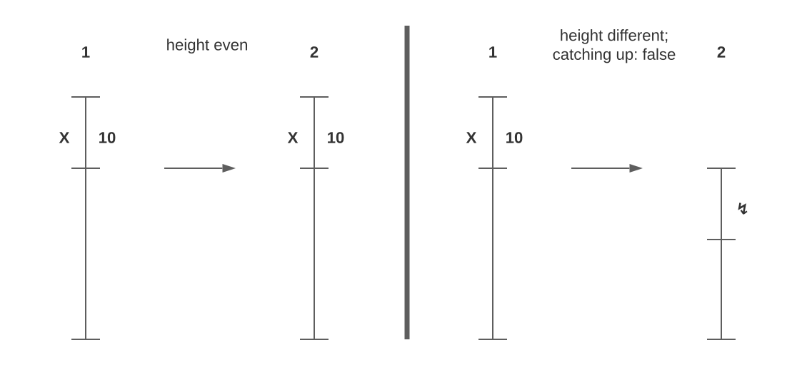

# Preparation

**Target:**
Want to test different consensus heigth's as happend during last double signing (catching_up: false; different consensus height's)



## Environment

`gaiad version: HEAD-042b7ef3bf07c4dc3d57eb733cd905b5bac22706 (v4.0.5)`

`signctrl version: 71982ac0d618eafec0652474f3298cb9fd5f8ee8`

`two aws t3a.medium with 100G gp2 ssd storage (default iops): signctrl-val-1, signctrl-val-2`

`t3.small with 100G gp2 ssd storage (default iops): signctrl-master`

Local Network with tree nodes:

SignCtrl Master:

signctrl-master: `999999stake` voting power

signctrl-val-1: `494999stake` voting power

signctrl-val-2: `494999stake` voting power (same priv_validator_key.json as signctrl-val-1)

## First Test

### Important test cmd's

`cd ./build`

### clean keys

`rm -rf keyring-tes`

### list accounts

`gaiad keys list --keyring-backend test --keyring-dir .`

### run msg send

`gaiad keys add main --recover --keyring-backend test --keyring-dir .`

`./gaiad tx bank send cosmos1h4u0nh2h7z4lj0v9ekge42wfpaug8dvksznrz4 cosmos10pt62z2vqzes58jkct32pvslr377wn86tz75c4 1stake --keyring-backend test --chain-id sc --generate-only --gas 198310000 --memo blockscape > unsigned.json`

`gaiad tx sign unsigned.json --chain-id sc --keyring-backend test --from main --node tcp://52.59.242.1:26657 > signed.json`

`gaiad tx broadcast signed.json --node tcp://52.59.242.1:26657`

### view balances

`gaiad q bank balances cosmos1h4u0nh2h7z4lj0v9ekge42wfpaug8dvksznrz4 --node tcp://52.59.242.1:26657`

`gaiad q bank balances cosmos10pt62z2vqzes58jkct32pvslr377wn86tz75c4 --node tcp://52.59.242.1:26656`

### unjail validator

`gaiad tx slashing unjail --from validator --chain-id sc --home /data --memo "THIS IS THE MEMO" --keyring-backend test`

### show validator address (cosmosvalconspub1)

`gaiad tendermint show-validator --home /data`

### show signing infos

`gaiad q slashing signing-info cosmosvalconspub1zcjduepq5ql8rzrle438f400ujelrxyu4jj82yuggwqnm3acxkaretpc82lsvn8w3g`

## Results

## 1. testing

with 13000 tx msgs and config toml as configured in this commit

sign ctrl swaps to second node:

```
Mar 08 15:09:41 signctrl-val-1 signctrl[2811]: [INFO] signctrl: Signed SIGNED_MSG_TYPE_PRECOMMIT for block height 51049
Mar 08 15:09:45 signctrl-val-1 signctrl[2811]: [INFO] signctrl: Missed too many blocks in a row (1/1)
Mar 08 15:09:45 signctrl-val-1 signctrl[2811]: [ERR] signctrl: couldn't handle request: node cannot be promoted anymore, so it must be shut down
Mar 08 15:09:45 signctrl-val-1 signctrl[2811]: [INFO] signctrl: Stopping SignCTRL on rank 1...
Mar 08 15:09:45 signctrl-val-1 signctrl[2811]: [INFO] signctrl: Saving current rank 1 to last_rank.json...
Mar 08 15:09:45 signctrl-val-1 signctrl[2811]: [INFO] signctrl: Shutting SignCTRL down... ⏻ (quit)
```